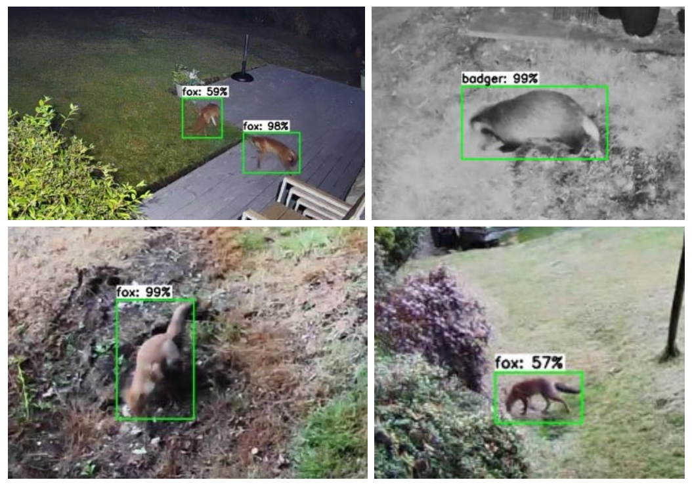

# TensorFlow Lite Animal Detector & Deterrent

### A Python tool built with TensorFlow Lite to detect badgers & foxes via a RTSP stream from Ring cameras



<br/>

This project provides a tool to accurately detect foxes foxes and badgers from [Ring](https://www.ring.com) / Real Time Streaming Protocol (RTSP) cameras and publish events to an MQTT broker when detection occurs. 

This project wouldn't be possible without the great work from -
- The excellent Edje Electronics video - https://www.youtube.com/watch?v=XZ7FYAMCc4M 
- Edje Electronics Google Colab Workbook - https://colab.research.google.com/drive/1s544e127RX07pXmU-x5mgWD8joiwC2jY
- Towards Data Science opencv motion detection blog - https://towardsdatascience.com/image-analysis-for-beginners-creating-a-motion-detector-with-opencv-4ca6faba4b42
- The [ring-mqtt](https://github.com/tsightler/ring-mqtt) project

<br/>

# Requirements

## Cameras

This project has been designed to work with Ring and RTSP cameras, i.e. [Annke C500](https://uk.annke.com/products/c500?variant=43505451172052). This could also be modified to work with attached cameras but some modification of ``src/video_streaming/video_stream.py`` would be needed. 

## Environment

- Ubuntu / MacOS / Windows
- Python 3.10 (ensures Tensorflow compatibility)
- Docker

## A note on the TensorFlow Lite model

Please feel free to use my pre-trained model in `src/models/custom_trained/ssdmobilenet_v2_640_v2`. I have trained this against ~1k images of foxes/badgers/people/cats/birds/squirrels in my garden but you'll probably have better success in training your own model (see the training section below).

I had best success with the [SSD MobileNet V2 FPNLite 640x640](http://download.tensorflow.org/models/object_detection/tf2/20200711/ssd_mobilenet_v2_fpnlite_640x640_coco17_tpu-8.tar.gz) model

### ssdmobilenet_v2_640_v2 results

```
***mAP Results***

Class           Average mAP @ 0.5:0.95
---------------------------------------
fox             77.41%
badger          87.84%
person          87.34%
cat             90.00%
bird            80.83%
swing           89.81%
robomower               90.00%
squirrel                95.62%
dog             100.00%

Overall         88.76%
```

### ssdmobilenet_v2_320

```
***mAP Results***

Class           Average mAP @ 0.5:0.95
---------------------------------------
fox             41.96%
badger          59.63%
person          43.86%
cat             35.00%
bird            34.14%
swing           56.99%
robomower               60.00%
squirrel                41.25%
dog             0.00%

Overall         41.43%
```

# Installation

## 1. Install requirements

1. Follow the [ring-mqtt installation guide](https://github.com/tsightler/ring-mqtt/wiki/Installation-(Docker)) - note the ``docker/`` folder in this project with my sample Docker Compose file
2. Create a virtual environment, I'm using virtualenv on Windows. Note the `Set-ExecutionPolicy` command which allows this to run on Windows. 

```bash
python -m pip install virtualenv
virtualenv .venv
Set-ExecutionPolicy Unrestricted -Scope Process
./venv/Scripts/activate
```
*Note - these commands are based on a Windows install. I started building this out on MacOS but I didn't have access to a powerful GPU, so I switched to my gaming rig which happens to be a Windows maachine.*

3. Install pre-requisites

```bash
python -m pip install pyyaml==5.3
python -m pip install src/models/research/
cp protobuf-fix/builder.py .venv/Lib/site-packages/google/protobuf/internal
python -m pip uninstall tensorflow 
python -m pip install tensorflow-cpu==2.10
python -m pip install tensorflow-directml-plugin
touch .\src\constants_sensitive.py
```
- *Note the uninstall of Tensorflow as the one included with the TensorFlow Research folder does not work with DirectML (DX12 GPU acceleration)*
- *Note the protobuf fix based on [this thread](https://stackoverflow.com/questions/71759248/importerror-cannot-import-name-builder-from-google-protobuf-internal)*
- *Note the `constants_sensitive.py` is needed for passwords*

4. (OPTIONAL) I've had streaming issues due to UDP packet drops. Add the following to ``/etc/sysctl.conf`` in the WSL Ubuntu distro to resolve this

```bash
net.core.rmem_max=2097152
net.core.rmem_default=2097152
```

5. Test the local installation by running `model_builder_tf2_test.py` to make sure everything is working as expected. 

```bash
python src/models/research/object_detection/builders/model_builder_tf2_test.py
```

## 2. Configure your constants

Modify the `src/constants.py`

## 3. Run!

```bash
python src/tf_model_stream_analysis.py
```

<br/>
<br/>

# Train your own model

The existing model has been trained against foxes and badgers in my garden. To train your own model - 

1. Add images and PASCAL VOC .xml annotated files to ``training-content/images/all``. See this [excellent tutorial](https://www.youtube.com/watch?v=v0ssiOY6cfg&ab_channel=EdjeElectronics) for more information on training your own images and providing 
2. Run the Python script to randomly move 80% of the images to the "train" folder, 10% to the "validation" folder, and 10% to the "test" folder.
```bash
python training-content/train_val_test_split.py
```
3. Ensure `/content/labelmap.txt` has labels that match those of the labels you added when you were annotating your images
4. Run data conversion scripts - they will create TFRecord files for the train and validation datasets, as well as `labelmap.pbtxt` file which contains the labelmap in a different format

```bash
python training-content/create_csv.py
python training-content/create_tfrecord.py --csv_input=training-content/images/train_labels.csv --labelmap=training-content/labelmap.txt --image_dir=training-content/images/train --output_path=training-content/train.tfrecord
python training-content/create_tfrecord.py --csv_input=training-content/images/validation_labels.csv --labelmap=training-content/labelmap.txt --image_dir=training-content/images/validation --output_path=training-content/val.tfrecord
python training-content/create_tfrecord.py --csv_input=training-content/images/test_labels.csv --labelmap=training-content/labelmap.txt --image_dir=training-content/images/test --output_path=training-content/test.tfrecord
```
<br/>


5. Updating the following variables in `src/constants.py` to control training. Other training information, like the location of the pretrained model file, the config file, and total number of classes are located in the `training-content/prepare-training.py` script
- `TRAINING_NUM_STEPS`: The total amount of steps to use for training the model. A good number to start with is 40,000 steps. You can use more steps if you notice the loss metrics are still decreasing by the time training finishes. The more steps, the longer training will take. Training can also be stopped early if loss flattens out before reaching the specified number of steps.
- `TRAINING_BATCH_SIZE`: The number of images to use per training step. A larger batch size allows a model to be trained in fewer steps, but the size is limited by the GPU memory available for training. With the GPUs used in Colab instances, 16 is a good number for SSD models and 4 is good for EfficientDet models. Don't go below 2 as this will cause issues.
- `TRAINING_MODEL_FOLDER_NAME`: The name of the sample model from `src/models/model_zoo`

<br/>

6. Run `training-content/prepare_training.py` which will produce `training-content/pipeline.config`.

7. Install TensorBoard - Open the Command Palette (⇧⌘P) and search for Python: LaunchTensorBoard. You'll be prompted to select the folder where your TensorBoard log files are located - browse and select `training-content/training/train`.  

8. Run training!
Run the following. Note that if you change the number of steps in `src/constants.py` then you must update it in this command -

```bash
python src/models/research/object_detection/model_main_tf2.py --pipeline_config_path=training-content/pipeline.config --model_dir=training-content/training --alsologtostderr --num_train_steps=40000 --sample_1_of_n_eval_examples=1
```

9. Convert Model to TensorFlow / TensorFlow Lite

```bash
python .\src\models\research\object_detection\export_tflite_graph_tf2.py --trained_checkpoint_dir=training-content/training-ssd-640 --output_directory=src/models/custom_trained/ssdmobilenet_v2_640 --pipeline_config_path=src/models/custom_trained/ssdmobilenet_v2_640/pipeline_file.config
```

10. Run the conversion process using the TFLiteConverter - note, update the model directory in the python script `training-content/convert_to_tflite.py`

11. Test your model & Calculate mAP

- Create the following directories inside `/training-content/mAP/input` 
    - `/detection-results`
    - `/ground-truth`
    - `/images-optional`
- Move your test images to the mAP tool - `cp training-content/images/test/* training-content/mAP/input/images-optional`
- Move xml files to appropriate folder - `mv training-content/mAP/input/images-optional/*.xml training-content/mAP/input/ground-truth/`
- The calculator tool expects annotation data in a format that's different from Pascal VOC .xml format we're using. Run 

```bash
python training-content/mAP/scripts/extra/convert_gt_xml.py
```

- Update the test script in `training-content/test_trained_model.py` to support your model
- Run the testing script 

```bash
python training-content/test_trained_model.py
```

- Calculate mAP 

```bash
python training-content/mAP/calculate_mAP.py
```